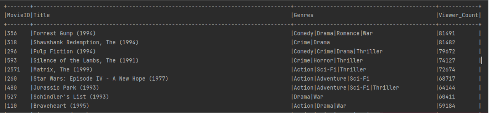
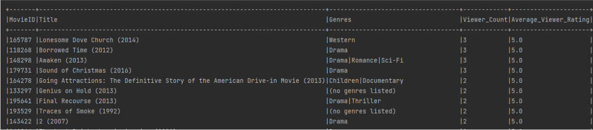
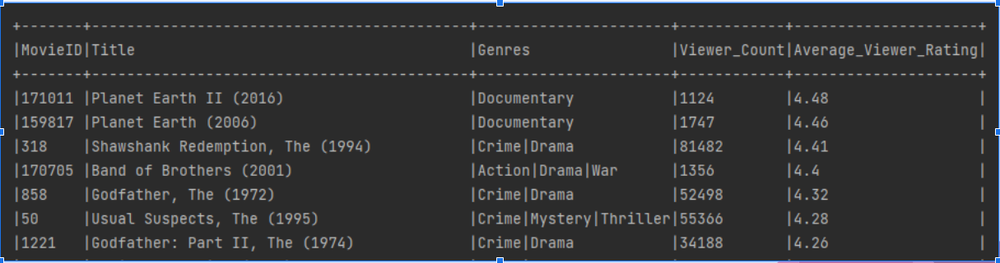

# Popular_Movie

# Table Of Contents

## [Description](#description)

## [Screenshot](#screenshot)

## [Repository](#repository)

## [Tech Used](#tech)

# Description 
As a user, I want to find the most popular movie base on the user's preference(average viewer ratings, viewer count, genre)
# Screenshot 
# Popular Movie base on View Count 

# Popular Movie base on Highest Rating

# Popular Movie with Highest Rating and Viewer Count

# Repository 
https://github.com/swoo328/popular_movie

# Tech Used 
1. Python
2. Pyspark
3. CSV
